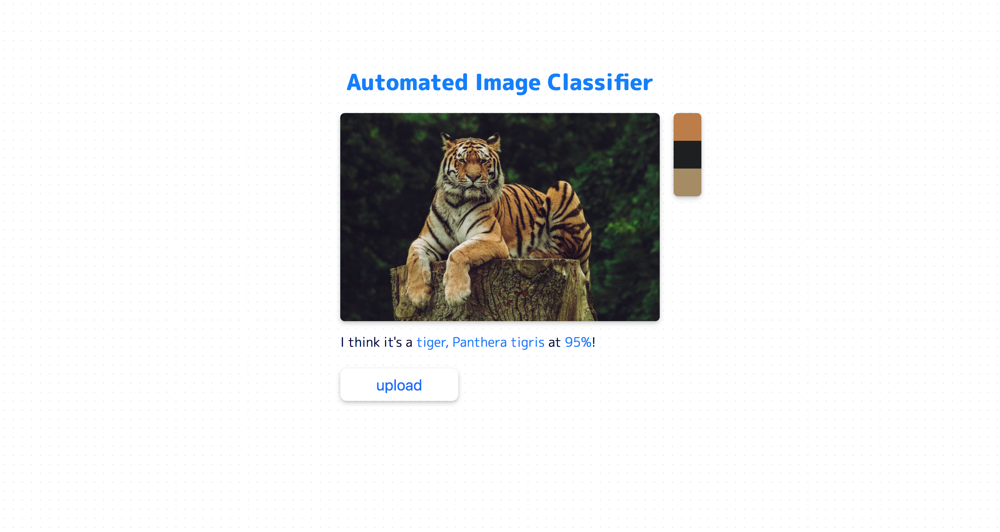

## React-TensorflowJS-Img-Classifier

This is a Image Recognition app that use Tensorflow.js mobilenet pre-trained model to add a label to the chosen image. It also create a 3 colors palette from the image. 

You can try it at:
https://tensorflow-img-clf.herokuapp.com/
